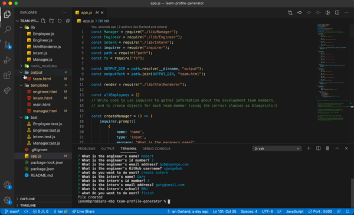

# Team Profile Generator

## Description 

Generate profiles for you team. Run node app in your terminal to quickly input your team's information via prompts in the command line. Once complete, an html file is deposited in the output folder with your team's information organized in an easy to digest format.

## Table of Contents

- [Description](#description)
- [Installation](#installation)
- [Usage](#usage)
- [Contributing](#contributing)
- [Testing](#testing)
- [Questions](#questions)
## Installation

- Node
- fs
- inquirer
- path

## Usage

Once all packages are installed run `node app.js` in the command line of the terminal to being the generator

## Contributing

Ian Darland

## Testing

- Jest

## Questions

Email: ianpdarland@gmail.com

Github: www.github.com/iandarland